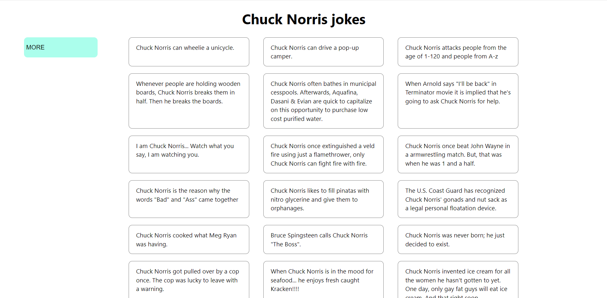

# Chuck Norris Jokes Generator

I created this app in order to learn new technologies, such as Redux-Saga and React. To get a joke, I sent a request to a special API: https://api.chucknorris.io/jokes/random

# Application Features

- Give out a random Chuck Norris' joke

# Stack Technologies

- React
- Redux
- Redux-Saga
- Chuck Norris API

# Testing

To test the application, you need to enter the following commands:

You need to clone the repository using the command:`git@github.com:ToxichQQQ/joke-generator.git`

After the repository has been copied, go to the repository and run the `npm install command`.

Start the application using the `npm start`

# Thanks for your attention

You can contact me by this email storozhenko.dev@gmail.com
